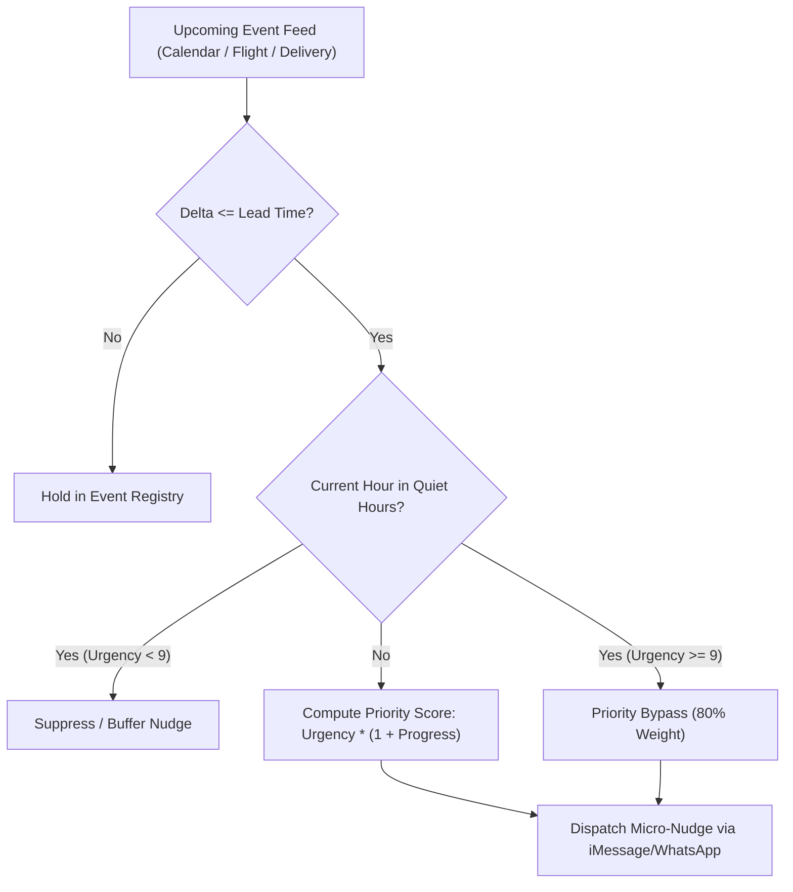

# genpark-messaging-agent-proactive-nudge-scheduler-skill

> Proactive Contextual Nudge Scheduler for Messaging-Native Personal AI Agents. 100% Python Standard Library.

Distilled from cutting-edge personal assistants (**Poke**, **Caddy**), this skill enables messaging agents to transition from reactive question-answering into proactive life-context assistants.

## Architecture

## Features
- **100% Python Standard Library**: Zero external dependencies, highly auditable and embeddable.
- **Dynamic Priority Decay & Urgency Scaling**: Accurately computes when a reminder is most salient.
- **Quiet-Hours Smart Gating**: Automatically halts low-priority notifications between night hours while permitting critical emergency bypasses.
